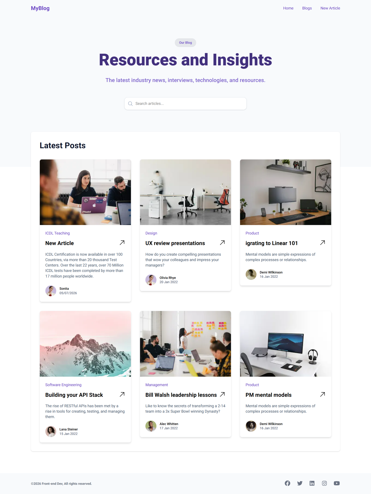

# Personal Blogs

## About

A responsive Personal Blogs built using Next.js and Tailwind CSS and MockData.
Created to practice frontend development and showcase my skills. 

## Features

- Responsive Design
- Clean UI
- Mobile Friendly
- Fast Performance
- SEO Friendly
- Hero Section
- Pricing Section
- MockData
- CRUD Operation

## Technologies

- Next.js
- React
- Tailwind CSS
- JavaScript
- Figma Template

## Installation

Clone the repository

```bash
git clone YOUR_REPOSITORY_LINK

npm install

npm run dev
# or
yarn dev
# or
pnpm dev
# or
bun dev
```

Open [http://localhost:3000](http://localhost:3000).

# Folder Structure
src/
app/
components/
blogs/
new-article/
assets/
public/
docs/
data/

## Screenshot


 

## Live Demo

https://landing-page-with-nextjs-two.vercel.app/

## Author

GitHub:
https://github.com/jafarisonita-lgtm

